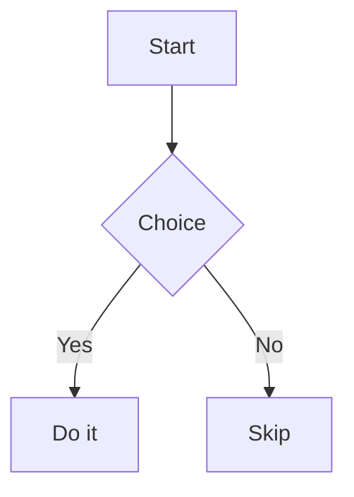
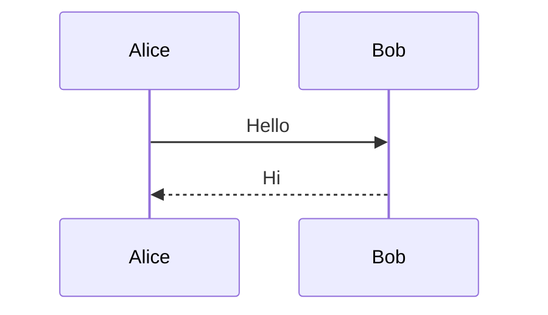

# Diagrams

```mermaid
graph TD
    A[Start] --> B{Choice}
    B -->|Yes| C[Do it]
    B -->|No| D[Skip]
```

```mermaid
sequenceDiagram
    Alice->>Bob: Hello
    Bob-->>Alice: Hi
```

Text after.
